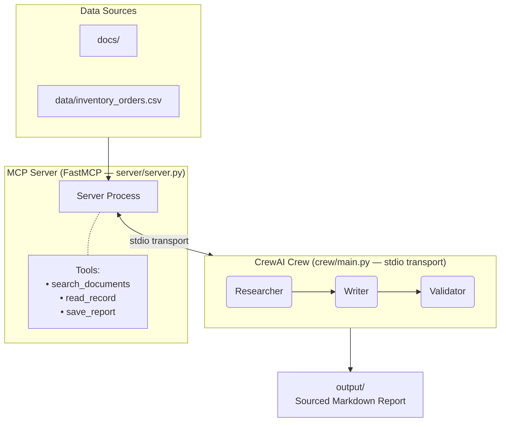

# Operations Assistant — MCP + CrewAI
> Developed by **Sudhanshu Biswas** (Week 14 Mini-Project · Futurense AI Clinic)

A multi-agent assistant that searches local documents and order records to answer business questions — with every fact cited back to its source.

---

## How it works



---

## Prerequisites

| Tool | Version | Install |
|---|---|---|
| Python | 3.11 or 3.12 | [python.org](https://www.python.org/downloads/) |
| uv | latest | `pip install uv` or [docs.astral.sh/uv](https://docs.astral.sh/uv/) |
| Ollama | latest | [ollama.com/download](https://ollama.com/download) |
| Node.js | 18+ (for MCP Inspector only) | [nodejs.org](https://nodejs.org/) |

Pull your chosen model once Ollama is running:
```bash
ollama pull llama3        # or mistral, phi3, gemma2, etc.
```

---

## Setup

```bash
# 1. Clone
git clone https://github.com/SudhanshuBiswas01/Crew_AI_MCP_Agents.git
cd Crew_AI_MCP_Agents

# 2. Install dependencies
uv sync --dev

# 3. Configure environment
cp .env.example .env
#    Edit .env:
#      MODEL_NAME=ollama/llama3   ← match your pulled model
#      OPENAI_API_BASE=http://localhost:11434
#      OPENAI_API_KEY=ollama       ← Ollama ignores this, but CrewAI requires it
```

---

## Run the MCP Server

**Plain terminal (stdio mode):**
```bash
uv run ops-server
# or
uv run python server/server.py
```

**Inside MCP Inspector** (visual tool tester — recommended for development):
```bash
npx @modelcontextprotocol/inspector uv run python server/server.py
```
Open the Inspector URL printed in the terminal, then call `search_documents`, `read_record`, or `save_report` manually to verify the tools work before connecting the crew.

---

## Run the Crew

```bash
# Default sample question
uv run ops-crew

# Custom question
uv run ops-crew --question "What is the status of order #5 and does our return policy cover it?"
```

The crew will:
1. **Researcher** → calls `search_documents` + `read_record` to gather evidence
2. **Writer** → drafts a sourced markdown report and calls `save_report`
3. **Validator** → checks every claim has a citation; outputs `APPROVED` or `FLAGGED`

Results are printed to the terminal. The report is saved to `output/`. A JSON trace is saved to `traces/`.

---

## Run Tests

```bash
# Unit tests only (no Ollama required — fast)
uv run pytest -v

# End-to-end test (requires Ollama running)
uv run pytest -v -m e2e

# All tests
uv run pytest -v -m "e2e or not e2e"
```

---

## Folder Map

```
Crew_AI_MCP_Agents/
├── README.md               ← you are here
├── .env.example            ← copy to .env and fill in values
├── pyproject.toml          ← uv / PEP 517 config + entry points
├── requirements.txt        ← flat pin list (for non-uv users)
│
├── docs/                   ← 12 short .txt knowledge documents
├── data/
│   └── inventory_orders.csv ← 40-row orders spreadsheet
│
├── server/
│   └── server.py           ← FastMCP server (3 tools + 1 resource)
│
├── crew/
│   ├── agents.py           ← Researcher, Writer, Validator agents
│   ├── tasks.py            ← Task definitions with expected outputs
│   └── main.py             ← Crew entry point + trace saving
│
├── tests/
│   ├── test_tools.py       ← Unit tests for MCP tools (no Ollama needed)
│   └── test_crew_e2e.py    ← E2E test: crew on a fixed question
│
├── traces/                 ← Auto-generated JSON run traces
├── output/                 ← Auto-generated markdown reports
├── examples/               ← 3 sample questions + saved outputs
├── demo/                   ← 5-minute clip or link
├── decision_log.md         ← Design decisions and trade-offs
└── reflection.md           ← Post-project reflection answers
```

---

## Sample Questions to Try

```bash
uv run ops-crew --question "What is our return policy for hardware?"
uv run ops-crew --question "List all pending orders and their total value."
uv run ops-crew --question "Which customers have cancelled orders and why might that be?"
```

---

## Key Design Decisions

- **stdio transport** — zero infrastructure; MCP server runs as a subprocess of the crew.
- **Ollama** — fully local, no API key or cost.
- **Validator agent** — catches hallucinations before they reach the report.
- **Pydantic schemas** on every tool input — rejects bad data before it hits file I/O.
- **`max_iter=10`** on every agent — prevents runaway loops.

See [`decision_log.md`](decision_log.md) for the full reasoning.

---

## Security Notes

- `.env` is in `.gitignore` — never commit real keys.
- Tool inputs are validated; raw strings are never passed to shell commands or file paths.
- Only connect this server to models/agents you control.

---

## References

- MCP intro: <https://modelcontextprotocol.io/docs/getting-started/intro>
- FastMCP tutorial: <https://gofastmcp.com/tutorials/create-mcp-server>
- MCP Inspector: <https://github.com/modelcontextprotocol/inspector>
- CrewAI + MCP: <https://docs.crewai.com/en/mcp/overview>
- CrewAI docs: <https://docs.crewai.com>
